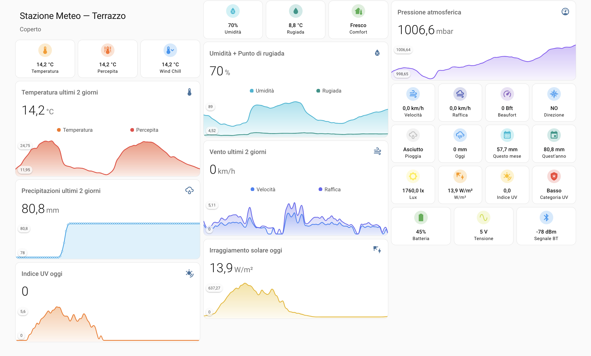

# 🌤 Shelly WS90 Weather Station — Full Home Assistant Integration with ESPHome Display

A complete smart weather station project built around the **Shelly WS90**, integrated with **Home Assistant** via BTHome Bluetooth proxy, enriched with custom sensor templates, a polished Lovelace dashboard, and a real-time **SenseCAP Indicator D1** touchscreen display powered by ESPHome.

---

## 📸 Screenshots

### Home Assistant Dashboard


### SenseCAP Indicator Display

---

## 🎯 Project Overview

This project turns a Shelly WS90 outdoor weather station into a fully integrated smart home weather system. All data is collected via Bluetooth (BTHome protocol), processed through custom Home Assistant sensor templates, displayed on a beautiful Lovelace dashboard, and mirrored on a dedicated 4-inch touchscreen display placed indoors.

**Key features:**
- Real-time weather data from Shelly WS90 via BTHome
- Custom sensor templates: Beaufort scale, wind direction (16 cardinal points), heat index, wind chill, UV category, solar irradiance estimation
- Daily, monthly and yearly rain accumulation via utility meters
- Polished Lovelace dashboard optimized for mobile
- SenseCAP Indicator D1 touchscreen display with LVGL interface
- Bluetooth proxy built into the SenseCAP for extended BLE range
- Boot screen with spinner animation
- Automatic display on/off via time-based automation

---

## 🛒 Hardware Required

| Component | Description |
|-----------|-------------|
| **Shelly WS90** | Outdoor solar-powered weather station |
| **SenseCAP Indicator D1** | 4-inch 480x480 touchscreen display (ESP32-S3 + RP2040) |
| **ESP32 Bluetooth Proxy** | Any ESP32 running ESPHome as BLE proxy (or use SenseCAP) |
| Home Assistant server | Raspberry Pi, NUC, or any HA-compatible hardware |

---

## 🏗 Architecture
```
Shelly WS90 (outdoor)
        │
        │ Bluetooth (BTHome)
        ▼
ESP32 Bluetooth Proxy ──────────────────────────────────┐
        │                                               │
        │ WiFi                                          │
        ▼                                               │
Home Assistant                                          │
  ├── BTHome Integration                                │
  ├── Custom Sensor Templates (templates.yaml)          │
  ├── Utility Meters (utility_meter.yaml)               │
  ├── Lovelace Dashboard                                │
  └── ESPHome Integration                               │
              │                                         │
              │ WiFi (API)                              │
              ▼                                         │
  SenseCAP Indicator D1 ◄──────────────────────────────┘
    ├── LVGL Display (weather data)
    ├── Bluetooth Proxy (active)
    └── FT5X06 Touchscreen
```

---

## 📁 File Structure
```
├── README.md
├── .gitignore
├── secrets.yaml.example
├── esphome/
│   └── sensecap-indicator.yaml      # SenseCAP ESPHome configuration
└── homeassistant/
    ├── configuration.yaml.example   # configuration.yaml additions
    ├── templates.yaml               # Custom sensor templates
    ├── utility_meter.yaml           # Rain accumulation meters
    ├── logbook_exclude.yaml         # Logbook exclude list
    └── dashboard_meteo.yaml         # Lovelace dashboard
```

---

## ⚙️ Home Assistant Configuration

### 1. Prerequisites

- Home Assistant with BTHome integration enabled
- Shelly WS90 paired via BTHome
- At least one ESP32 running as Bluetooth proxy

### 2. Sensor Templates

Add to `configuration.yaml`:

```yaml
template: !include templates.yaml
utility_meter: !include utility_meter.yaml
logbook:
  exclude:
    entities: !include logbook_exclude.yaml
```

The `templates.yaml` file creates these derived sensors from raw WS90 data:

| Sensor | Description |
|--------|-------------|
| `sensor.vento_beaufort` | Wind speed on Beaufort scale (0-12) |
| `sensor.direzione_vento_testo` | Wind direction as text (N, NNE, NE...) |
| `sensor.velocita_vento_km_h` | Wind speed converted from m/s to km/h |
| `sensor.raffica_vento_km_h` | Wind gust converted from m/s to km/h |
| `sensor.temperatura_percepita` | Heat Index when T ≥ 27°C (Rothfusz formula) |
| `sensor.temperatura_wind_chill` | Wind Chill when T ≤ 10°C (Canadian formula) |
| `sensor.comfort_termico` | Thermal comfort (Gelido → Afoso) |
| `sensor.pressione_tendenza` | Pressure with stability category attribute |
| `sensor.irraggiamento_solare` | Solar irradiance estimated in W/m² from lux |
| `sensor.categoria_uv` | UV category (Basso → Estremo) per WHO scale |
| `sensor.condizione_meteo` | General weather condition with dynamic icon |
| `sensor.stato_batteria_ws90` | Battery status with dynamic icon |

The `utility_meter.yaml` creates:

| Sensor | Reset |
|--------|-------|
| `sensor.pioggia_giornaliera` | Daily at midnight |
| `sensor.pioggia_mensile` | Monthly on 1st |
| `sensor.pioggia_annuale` | Yearly on Jan 1st |

### 3. Lovelace Dashboard

The dashboard is organized in sections:
- **Weather condition** — prominent card with dynamic icon
- **Temperature** — current, perceived, wind chill + 48h graph
- **Humidity & Pressure** — dew point, comfort + graphs
- **Wind** — speed, gust, Beaufort, direction (vertical layout)
- **Rain** — current, daily, monthly, yearly + graph
- **Solar & UV** — lux, W/m², UV index, UV category + separate graphs
- **System** — battery, voltage, BT signal

Required HACS cards:
- `mushroom` (v5.1.1+)
- `mini-graph-card`

---

## 📟 SenseCAP Indicator D1 Setup

The SenseCAP Indicator D1 runs a custom ESPHome firmware that:
- Connects to Home Assistant via native API
- Displays real-time weather data using LVGL graphics
- Acts as an active Bluetooth proxy for extended WS90 range
- Shows a boot screen with spinner animation while connecting
- Turns on/off automatically via HA time-based automation
- Toggles display manually via the physical button

### Key ESPHome components used:
- `st7701s` display driver (480x480 RGB)
- `ft5x06` touchscreen controller
- `lvgl` for UI rendering
- `bluetooth_proxy` for BLE forwarding
- `pca9554` GPIO expander

### Display layout:
┌─────────────────────────────────────┐
│ 14:08                    29/03/2026 │  ← Time & Date
├─────────────────────────────────────┤
│        OUTDOOR TEMPERATURE          │
│               19.2°                 │  ← Large temperature (72pt font)
│           Confortevole              │  ← Comfort level
│       Parzialmente nuvoloso         │  ← Weather condition
├─────────────────────────────────────┤
│ HUMIDITY  PRESSURE  RAIN TODAY   UV │
│   21%      1001hPa    0.0mm      2.0│
├─────────────────────────────────────┤
│      Weather Station — Milan, Italy │
└─────────────────────────────────────┘


---

## 🚀 Installation

### Step 1 — Home Assistant

1. Clone this repository
2. Copy `homeassistant/templates.yaml`, `utility_meter.yaml` and `logbook_exclude.yaml` to your HA config directory
3. Add to `configuration.yaml` (see `configuration.yaml.example`)
4. Restart Home Assistant
5. Import the Lovelace dashboard via YAML editor

### Step 2 — SenseCAP Indicator

1. Open ESPHome in Home Assistant
2. Create a new device named `sensecap-indicator`
3. Copy the content of `esphome/sensecap-indicator.yaml`
4. Copy `secrets.yaml.example` to `secrets.yaml` and fill in your values
5. Flash via USB first time, then OTA for updates
6. Add the device to Home Assistant when discovered

### Step 3 — Automations

Create two automations in HA for automatic display control:
- **Display ON**: Trigger at 06:00 → `light.turn_on` → `light.backlight`
- **Display OFF**: Trigger at 22:00 → `light.turn_off` → `light.backlight`

---

## 🔧 Secrets Required

Copy `secrets.yaml.example` to `secrets.yaml` and fill in your values:

```yaml
wifi_ssid: "YourWiFiSSID"
wifi_password: "YourWiFiPassword"
ap_password: "YourFallbackAPPassword"
api_key: "YourESPHomeAPIKey"
ota_password: "YourOTAPassword"
web_username: "admin"
web_password: "YourWebServerPassword"
```

---

## 📊 Data Flow

The WS90 transmits these raw sensors via BTHome:
- Temperature, Humidity, Dew point
- Atmospheric pressure
- Wind speed (m/s), Wind gust (m/s), Wind direction (degrees)
- Precipitation (mm)
- Illuminance (lux), UV index
- Battery voltage

All raw data is enriched by sensor templates before being displayed.

---

## 🙏 Credits

- [ESPHome](https://esphome.io) — firmware framework
- [Home Assistant](https://www.home-assistant.io) — smart home platform
- [Mushroom Cards](https://github.com/piitaya/lovelace-mushroom) — Lovelace cards
- [Mini Graph Card](https://github.com/kalkih/mini-graph-card) — graph cards
- [Shelly](https://www.shelly.com) — WS90 weather station

---

## 📄 License

MIT License — feel free to use, modify and share!
